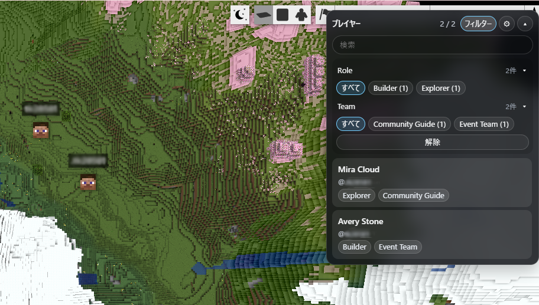
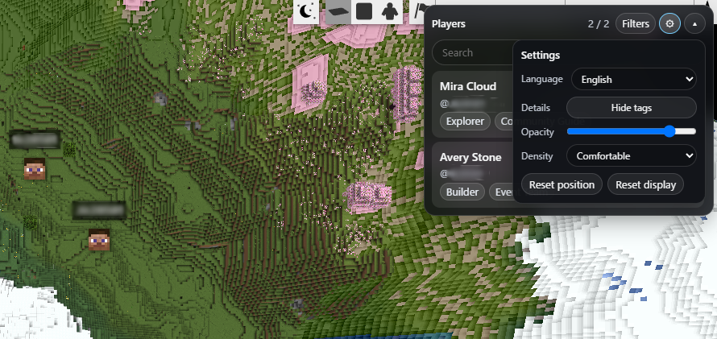
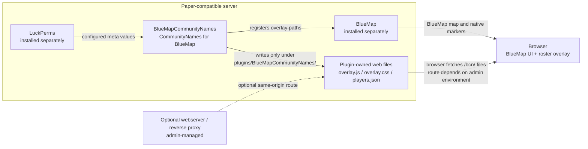

# CommunityNames for BlueMap

BlueMapCommunityNames, published as CommunityNames for BlueMap, is an independent PaperMC
plugin for Minecraft servers that adds a lightweight player roster overlay to the
BlueMap web app. It can show online Java and Bedrock/Floodgate players with
public-safe aliases, configurable LuckPerms metadata chips, filters, and search while
publishing plugin-owned JSON, JavaScript, and CSS assets for the browser overlay.

The plugin does not change BlueMap native marker names, hide markers, replace markers,
rewrite BlueMap's player-list DOM, or write into BlueMap or LuckPerms folders.

## Download

Download the current public prerelease jar from GitHub Releases:

- [BlueMapCommunityNames-0.2.0.jar](https://github.com/TK2F/community-names-for-bluemap/releases/download/v0.2.0/BlueMapCommunityNames-0.2.0.jar)
- [Release notes and SHA-256](https://github.com/TK2F/community-names-for-bluemap/releases/tag/v0.2.0)

SHA-256:

```text
5b2393282c1b00efdc7dafe6fc3cc9232ac97274331b97763c6f9ae6f1edfbee
```

This is a prerelease. BlueMap, LuckPerms, and any optional Geyser/Floodgate or
webserver/reverse-proxy components must be installed and managed separately.

## Requirements

- Paper-compatible Minecraft server
- Java 25
- BlueMap, installed separately
- LuckPerms, installed separately

Optional:

- Geyser and Floodgate, installed separately, if Bedrock support is desired
- nginx or another reverse proxy, only if the server administrator chooses that web
  exposure model

BlueMapCommunityNames does not bundle BlueMap, LuckPerms, Geyser, or Floodgate jars.

## Screenshots



The roster overlay can show public-safe aliases and configured LuckPerms metadata
chips. Filters and search help server administrators inspect online players by
configured metadata such as role or team. Player identifiers in these screenshots are
blurred for privacy.



The browser overlay settings are local to the current browser and include display options
such as opacity, density, details visibility, and language. The UI supports Japanese
and English display, so screenshots may show both languages when demonstrating the
language switch.

## Responsibility Boundary

BlueMapCommunityNames is responsible for:

- reading configured LuckPerms meta values
- generating its own `players.json`, `overlay.js`, and `overlay.css`
- rendering its own BlueMap web overlay
- preserving BlueMap native markers
- writing only under `plugins/BlueMapCommunityNames/`

BlueMapCommunityNames is not responsible for:

- BlueMap map rendering, webserver behavior, native marker internals, resource downloads,
  or BlueMap configuration
- LuckPerms permissions, storage, identity configuration, or server-specific meta accuracy
- Geyser/Floodgate identity behavior beyond values exposed to the server plugin runtime
- nginx, reverse proxy, firewall, TLS, DNS, or network exposure decisions

Server administrators are responsible for installing, configuring, operating, and
reviewing BlueMap, LuckPerms, Geyser/Floodgate, and any network/proxy infrastructure
according to their own environment and those projects' documentation.

## Architecture



BlueMapCommunityNames adds only its own roster overlay. BlueMap map rendering, BlueMap
native markers, LuckPerms data, and optional webserver/reverse-proxy routing remain
admin-managed.

## Tested Environment

BlueMapCommunityNames was developed and validated on Paper 26.1.2 with Java 25, BlueMap,
LuckPerms, and optional Geyser/Floodgate. One WSL2 validation used local nginx with
same-origin `/bcn/` routing. This is a tested environment note, not a requirement or a
universal deployment model.

## Build

Use Java 25:

```sh
./gradlew clean test build --no-daemon
```

The plugin jar is generated at:

```text
build/libs/BlueMapCommunityNames-0.2.0.jar
```

Do not commit build output or plugin jars.

## Basic Installation

1. Install and configure BlueMap separately.
2. Install and configure LuckPerms separately.
3. Download `BlueMapCommunityNames-0.2.0.jar` from the current GitHub Release, or build
   it yourself from source.
4. Place the BlueMapCommunityNames jar in the server `plugins/` directory.
5. Start the server once to generate `plugins/BlueMapCommunityNames/config.yml`.
6. Configure the roster fields and display mode.
7. If your BlueMap web setup needs an explicit `/bcn/` route, configure that route in
   your own webserver or reverse proxy environment.
8. Restart or reload as appropriate for your server and BlueMap setup.

See:

- [Installation](docs/INSTALLATION.md)
- [Configuration](docs/CONFIGURATION.md)
- [Optional reverse proxy example](docs/REVERSE_PROXY_EXAMPLE.md)
- [Troubleshooting](docs/TROUBLESHOOTING.md)
- [Compatibility](docs/COMPATIBILITY.md)

Security policy: see [SECURITY.md](SECURITY.md).

Third-party notices and dependency boundary: see
[THIRD_PARTY_NOTICES.md](THIRD_PARTY_NOTICES.md).

## Roster Configuration

`community_name`, `title`, and `role` are sample defaults only. Server owners can
configure zero to three arbitrary LuckPerms meta keys. With zero fields, the roster shows
Minecraft IDs only and has no LuckPerms filters.

Roster name display is controlled separately from which LuckPerms keys are read:

- `alias_as_primary`: show the configured alias field as the main name when present,
  fall back to the Minecraft ID, and optionally show `@minecraft_id` as subtext.
- `minecraft_id_as_primary`: always show the Minecraft ID as the main name, and
  optionally show the alias as subtext or a chip.
- `minecraft_id_only`: always show the Minecraft ID as the main name. Alias values are
  hidden unless `show-alias-as-chip` is explicitly enabled.

If an alias is missing, blank, sanitized empty, or equal to the Minecraft ID after
normalization, the UI avoids empty or duplicate subtext and chips.

Example:

```yaml
player-roster:
  name-display:
    mode: minecraft_id_as_primary
    show-minecraft-id-as-subtext: true
    show-alias-as-subtext: true
    show-alias-as-chip: false
    minecraft-id-prefix: "@"

  luckperms-fields:
    max-fields: 3
    fields:
      - id: nickname
        meta-key: nickname
        label: "Nickname"
        display: alias
        searchable: true
        filterable: true
      - id: guild_name
        meta-key: guild_name
        label: "Guild"
        display: chip
        searchable: true
        filterable: true
      - id: event_rank
        meta-key: event_rank
        label: "Event Rank"
        display: chip
        searchable: false
        filterable: true
```

Existing v0.1 configs with only `meta-key` still work as a one-field alias roster.
Existing v0.2 `display.fields` configs are adapted when
`player-roster.luckperms-fields` is missing. If
`player-roster.luckperms-fields.fields` is explicitly empty, the roster uses Minecraft
IDs only.

## Bedrock / Floodgate Note

Java and Bedrock/Floodgate identities may be separate LuckPerms users. Depending on your
Floodgate/LuckPerms setup, Bedrock players may need UUID-based targeting for meta
assignment. Do not publish real UUIDs in documentation, issue reports, or screenshots.

## Commands

- `/bcn status`
- `/bcn rebuild`
- `/bcn reload`

Permission: `bluemapcommunitynames.admin`

## Uninstall

1. Stop the server.
2. Remove the BlueMapCommunityNames jar from `plugins/`.
3. Remove `plugins/BlueMapCommunityNames/` if you want to delete plugin-owned data.
4. Remove any optional `/bcn/` webserver route you added for this plugin.
5. Start the server and verify BlueMap and LuckPerms continue to work normally.

Removing BlueMapCommunityNames should not require deleting or editing BlueMap or
LuckPerms folders.

## Credits

Thanks to the maintainers and contributors of BlueMap, LuckPerms, Geyser, and Floodgate.
We are grateful to the developers, server operators, administrators, and community
members across the Minecraft ecosystem whose work and feedback make community server
projects possible.

BlueMapCommunityNames is an independent plugin and is not affiliated with, endorsed by,
or supported by Mojang, Microsoft, Minecraft, BlueMap, LuckPerms, Geyser, Floodgate, or
Paper.
