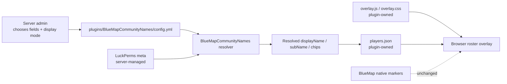

# Configuration

Configuration lives in:

```text
plugins/BlueMapCommunityNames/config.yml
```

Do not commit server-specific config containing private values.

## Data Flow



The plugin reads configured values and publishes its own roster data. It does not edit
LuckPerms data, BlueMap native markers, or BlueMap folders.

## Display Modes

`player-roster.name-display.mode` supports:

- `alias_as_primary`
- `minecraft_id_as_primary`
- `minecraft_id_only`

Legacy `community_name_as_primary` maps to `alias_as_primary` with a warning.

## LuckPerms Fields

Configure zero to three fields:

```yaml
player-roster:
  luckperms-fields:
    max-fields: 3
    fields:
      - id: nickname
        meta-key: nickname
        label: "Nickname"
        display: alias
        searchable: true
        filterable: true
      - id: guild_name
        meta-key: guild_name
        label: "Guild"
        display: chip
        searchable: true
        filterable: true
      - id: event_rank
        meta-key: event_rank
        label: "Event Rank"
        display: chip
        searchable: false
        filterable: true
```

`community_name`, `title`, and `role` are sample defaults only. Use keys that match your
own LuckPerms setup.

## Zero Fields

Set `fields: []` for a Minecraft-ID-only roster with no LuckPerms filters.

## Bedrock / Floodgate

Java and Bedrock/Floodgate players may be separate LuckPerms users. Depending on your
Floodgate/LuckPerms setup, Bedrock players may need UUID-based targeting for meta
assignment. Keep real UUIDs private.
