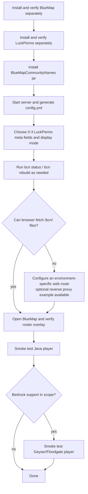

# Installation

BlueMapCommunityNames, published as CommunityNames for BlueMap, is installed as a normal
Paper plugin.

## Requirements

- Paper-compatible Minecraft server
- Java 25
- BlueMap installed separately
- LuckPerms installed separately

Optional:

- Geyser/Floodgate if Bedrock support is desired
- nginx or another reverse proxy only if your BlueMap web environment needs that model

## Steps



1. Install and verify BlueMap according to BlueMap's documentation.
2. Install and verify LuckPerms according to LuckPerms' documentation.
3. Build BlueMapCommunityNames:

```sh
./gradlew clean test build --no-daemon
```

4. Copy `build/libs/BlueMapCommunityNames-0.2.2.jar` to your server `plugins/`
   directory.
5. Start the server.
6. Confirm the plugin generated `plugins/BlueMapCommunityNames/config.yml`.
7. Configure roster fields and display mode.
8. Run `bcn status`.

If the browser cannot fetch `/bcn/overlay.js`, configure an appropriate web route for
your environment. See [Optional Reverse Proxy Example](REVERSE_PROXY_EXAMPLE.md).

## What Is Not Installed By This Plugin

BlueMapCommunityNames does not install, bundle, configure, or operate BlueMap,
LuckPerms, Geyser, Floodgate, nginx, firewalls, TLS, or DNS.
